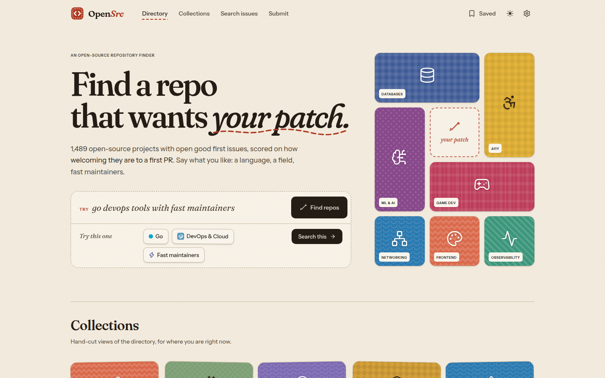
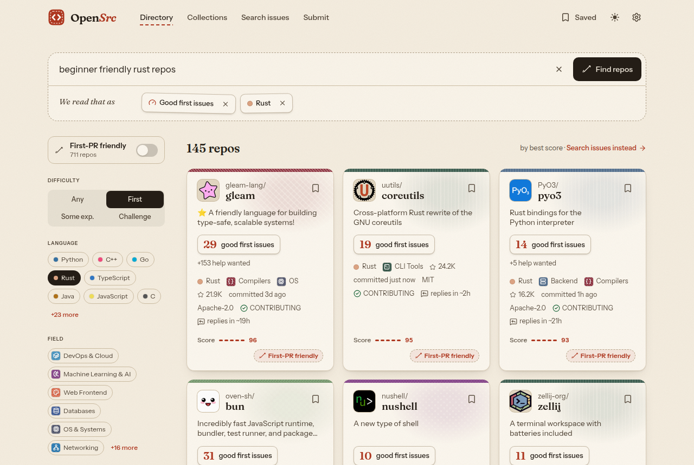
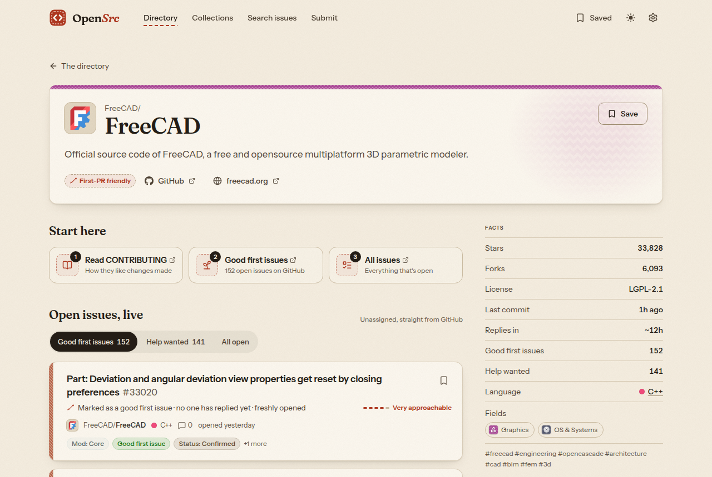
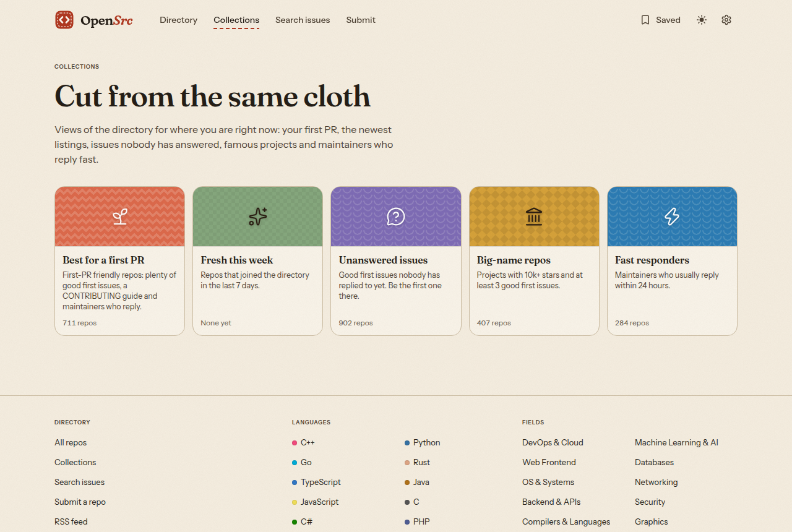

<div align="center">


# OpenSrc

**Find a repo that wants _your patch_.**

A free directory of open-source projects that are genuinely ready for new contributors,<br />
scored on how welcoming they are to a first pull request.

[**opensrc.studio**](https://opensrc.studio) · [Submit a repo](https://opensrc.studio/submit) · [Contributing](CONTRIBUTING.md) · [Report a problem](https://github.com/AaryanPuri/OpenSrc/issues)

[](https://github.com/AaryanPuri/OpenSrc/actions/workflows/ci.yml)
[](LICENSE)
[](https://opensrc.studio)
[](CONTRIBUTING.md)

<br />

<picture>
  <source media="(prefers-color-scheme: dark)" srcset="docs/images/home-dark.png" />
  
</picture>

</div>

---

## Contents

- [What is OpenSrc?](#what-is-opensrc)
- [Features](#features)
- [How repos are scored](#how-repos-are-scored)
- [How repos get listed](#how-repos-get-listed)
- [Run it locally](#run-it-locally)
- [Tech stack](#tech-stack)
- [Project structure](#project-structure)
- [Contributing](#contributing)
- [License](#license)

---

## What is OpenSrc?

Finding a place for your first open-source contribution is harder than it should be. Plenty of repos have a `good first issue` label, but the issues are already claimed, the maintainers never reply, or the project has been quiet for a year.

OpenSrc checks that for you. Every night it scans GitHub for active projects with open beginner issues, scores how welcoming each one is, and lists the best of them in one searchable directory.

- **For first-timers:** find a project with unclaimed good first issues, a CONTRIBUTING guide, and maintainers who actually reply.
- **For language-focused contributors:** browse by language or field and jump straight to live, open issues.
- **Free, with no paid listings:** a repo is listed because it scores well, not because anyone paid.

---

## Features

<table>
  <tr>
    <td width="50%" valign="top">
      <h3>🧵 Search in plain words</h3>
      <p>Type <em>"beginner friendly rust repos"</em> or <em>"go devops tools with fast maintainers"</em>. OpenSrc shows how it read you as removable patches (language, field, difficulty), and you refine by unpicking them.</p>
      
    </td>
    <td width="50%" valign="top">
      <h3>📋 A page for every repo</h3>
      <p>Facts, a <strong>"why this score"</strong> breakdown, three "Start here" links, and <strong>live, unassigned issues</strong> straight from GitHub in Good first / Help wanted / All tabs.</p>
      
    </td>
  </tr>
  <tr>
    <td width="50%" valign="top">
      <h3>🗂️ Collections</h3>
      <p>Best for a first PR · Fresh this week · Unanswered issues · Big-name repos · Fast responders. One click for where you are right now.</p>
      
    </td>
    <td width="50%" valign="top">
      <h3>✨ Also</h3>
      <ul>
        <li><strong>Browse by language and field:</strong> 31 languages and 22 fields, each with its own page.</li>
        <li><strong>Save repos, issues and searches</strong>, synced across devices when you sign in with GitHub.</li>
        <li><strong>A weekly email</strong> of new first-PR repos in your languages, or the RSS feed.</li>
        <li><strong>Issue search</strong> across all of GitHub at <code>/issues</code>.</li>
        <li><strong>Fast and indexable:</strong> every page is pre-rendered HTML, with a sitemap and an RSS feed.</li>
        <li><strong>Light and dark</strong> themes, keyboard shortcuts (<kbd>/</kbd> to search), reduced-motion support and AA contrast.</li>
      </ul>
    </td>
  </tr>
</table>

---

## How repos are scored

Every listed repo gets a **contributor-friendliness score from 0 to 100**, rebuilt nightly from GitHub data.

| Part                    | Weight | What it measures                                                                        |
| :---------------------- | -----: | :-------------------------------------------------------------------------------------- |
| **Issues to pick from** |     30 | Unclaimed (unassigned) good first issues, plus a little for help-wanted, on a log scale |
| **Recent activity**     |     15 | How recently the default branch saw a commit                                            |
| **Maintainer replies**  |     20 | Median time for a maintainer to first reply to a new issue                              |
| **Onboarding**          |     10 | CONTRIBUTING guide, code of conduct, a clear description                                |
| **Up for grabs**        |     15 | Share of good first issues that are still unassigned                                    |
| **Reach**               |     10 | Stars, damped so big names don't dominate                                               |

A repo is marked **🪡 First-PR friendly** when it scores **70 or more**, has **at least 3 unclaimed good first issues**, has a **CONTRIBUTING guide**, and maintainers reply **within 3 days** (or there isn't enough data yet). About a quarter of listed repos qualify.

Good first issues are counted across the label spellings projects really use (`good first issue`, `E-easy`, `D-Trivial`, `sprintable`, `first timers only` and more, see [`shared/labels.ts`](shared/labels.ts)).

<details>
<summary><strong>What keeps a repo out of the directory</strong></summary>

<br />

A repo isn't listed if it is archived, a fork or a mirror; has no license; has had no commit in the last 180 days; has fewer than 2 open good-first-issue or help-wanted issues; or has fewer than 30 stars (unless it was added by hand). The formula lives in [`shared/score.ts`](shared/score.ts).

</details>

---

## How repos get listed

1. **Automatically, every night.** A [GitHub Action](.github/workflows/collect.yml) searches GitHub for active repos with good first issues in every supported language, scores them, and opens a pull request with the updated dataset. A maintainer reviews and merges it.
2. **By suggestion.** Know a welcoming project we missed? Use **[Submit a repo](https://opensrc.studio/submit)**. It checks the repo against the same rules in your browser, then opens a prefilled [submission issue](https://github.com/AaryanPuri/OpenSrc/issues/new?template=submit-repo.yml). Accepted repos go into `data/curation.yml`.
3. **By hand.** Force-include, exclude or re-categorise a repo by editing [`data/curation.yml`](data/curation.yml) in a pull request.

Something wrong with a listing? Every repo page has a **Flag this repo** link, or use the [flag form](https://github.com/AaryanPuri/OpenSrc/issues/new?template=flag-repo.yml) directly.

---

## Run it locally

You need **Node.js 20+**.

```bash
git clone https://github.com/AaryanPuri/OpenSrc.git
cd OpenSrc
npm run setup   # install root tooling, frontend and backend
npm run dev     # web on http://localhost:5173 · API on http://localhost:8787
```

<details>
<summary><strong>Optional environment variables</strong></summary>

<br />

Copy `backend/.env.example` to `backend/.env`. Everything works without these.

| Variable            | What it enables                                                                             |
| :------------------ | :------------------------------------------------------------------------------------------ |
| `GITHUB_TOKEN`      | Higher GitHub rate limits for live issues (30 searches/min instead of 10)                   |
| `ANTHROPIC_API_KEY` | Claude reads free-text searches more accurately; falls back to the built-in rules parser    |
| `SITE_URL`          | The production URL used for canonical links and the sitemap (e.g. `https://opensrc.studio`) |
| `COLLECTOR_TOKEN`   | _(GitHub Actions secret)_ A read-only token for the nightly collector                       |

GitHub login, synced saves and the weekly newsletter are optional too (`DATABASE_URL`, `GITHUB_OAUTH_*`,
`SESSION_SECRET`, `RESEND_API_KEY`, `NEWSLETTER_*`). See [`docs/deploy.md`](docs/deploy.md#3-login--newsletter-optional).

</details>

<details>
<summary><strong>All scripts</strong></summary>

<br />

| Command                                 | What it does                                                      |
| :-------------------------------------- | :---------------------------------------------------------------- |
| `npm run dev`                           | Run the frontend and backend together with hot reload             |
| `npm run build`                         | Build the frontend (with every page pre-rendered) and the backend |
| `npm start`                             | Build, then serve the site and API from one Node server           |
| `npm test`                              | Frontend, shared and backend tests (Vitest)                       |
| `npm run typecheck` / `lint` / `format` | TypeScript, ESLint and Prettier                                   |
| `npm run e2e`                           | End-to-end tests in Chromium (Playwright), after `npm run build`  |
| `npm --prefix backend run collect`      | Run the repo collector locally (needs `GITHUB_TOKEN`)             |
| `npm --prefix backend run db:migrate`   | Create or update the optional database's tables                   |
| `npm --prefix backend run digest`       | Send the weekly newsletter (`-- --dry-run` to preview)            |

More detail: [`backend/README.md`](backend/README.md) (API and collector), [`docs/seo-and-prerender.md`](docs/seo-and-prerender.md) (pre-rendering) and [`docs/architecture.md`](docs/architecture.md) (parser and search internals).

</details>

---

## Tech stack

| Layer         | Tools                                                                                    |
| :------------ | :--------------------------------------------------------------------------------------- |
| **Frontend**  | React 18, TypeScript, Vite, Tailwind CSS, Framer Motion, React Router, Lucide icons      |
| **Rendering** | Build-time pre-rendering with React server rendering, then client hydration              |
| **Backend**   | Hono (Node or Cloudflare Workers), GitHub REST and GraphQL APIs, optional Claude parsing |
| **Data**      | A nightly collector on GitHub Actions writing a versioned JSON dataset                   |
| **Accounts**  | Optional: GitHub OAuth, libSQL (Turso), Resend for the weekly digest                     |
| **Quality**   | Vitest, Playwright, ESLint, Prettier and GitHub Actions CI                               |
| **Hosting**   | Cloudflare                                                                               |

---

## Project structure

```
OpenSrc/
├── frontend/     React app, pages, components, and the pre-render script
├── backend/      Hono API server and the nightly repo collector (src/pipeline)
├── shared/       Query parser, score, filters and collections, used by both halves
├── data/         repos.json (generated nightly) and curation.yml (hand-edited)
├── docs/         Extra documentation and README images
└── .github/      CI, the nightly collector workflow, and issue forms
```

---

## Contributing

Contributions of every size are welcome, and OpenSrc is a good place to make your first one. Read **[CONTRIBUTING.md](CONTRIBUTING.md)** to get set up, then pick an issue labelled [`good first issue`](https://github.com/AaryanPuri/OpenSrc/labels/good%20first%20issue).

Questions or ideas? Open an [issue](https://github.com/AaryanPuri/OpenSrc/issues) or email **hello@opensrc.studio**.

## License

[MIT](LICENSE) © 2026 Aaryan Puri
